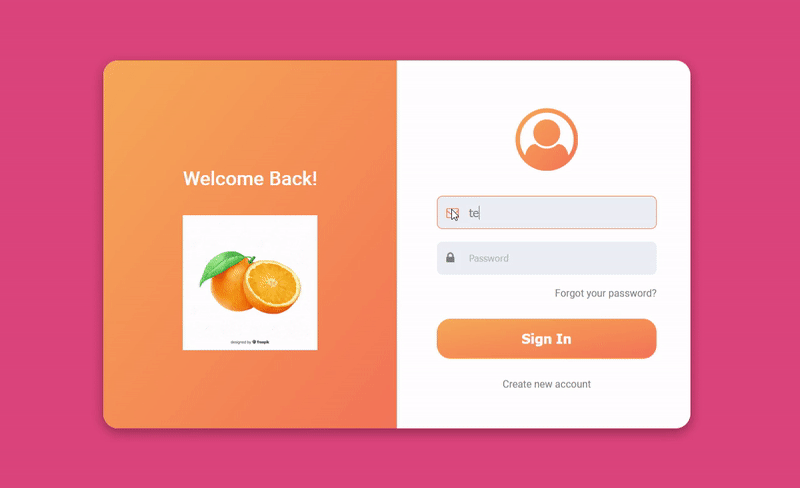

<h1 align="center"> Uma página de Login </h1>

 

<<<<<<< HEAD

=======
 

>>>>>>> 17dd8835860c465a23797e8842e7f344497f4c91
  

## 🚀 Tecnologias

Esse projeto foi desenvolvido com as seguintes tecnologias:

- HTML e CSS
- Javascript

## 📚 Um pouco do que foi visto

- Flexbox
- Responsividade com media queries
- Background-clip e text-fill-color
- Uso de variaveis no CSS
- Transition
- Uso da tag Dialog como modal com pseudo-elemento ::backdrop
- Um pouco de validações com Javascript usando Regex e HTML

